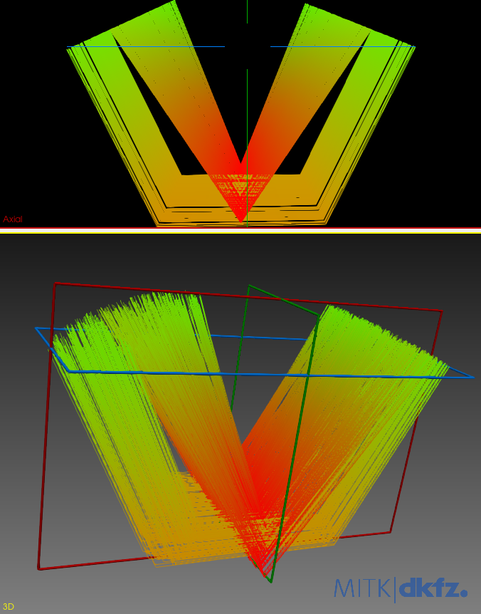
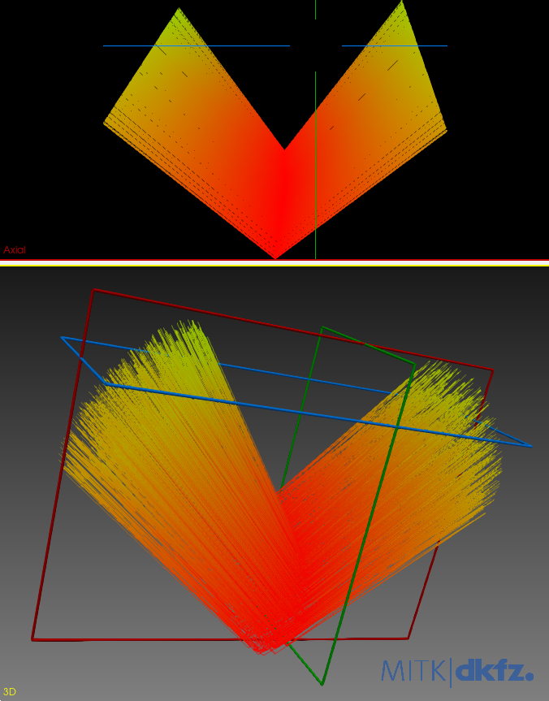

# Research

The goal of the project Fiber Config Generator is to create a 3D white matter fiber crossing simulator to generate
synthetic data in order to validate our new algorithms for processing of light sheet microscopy data. To do so, the
project was divided into two parts : identify potential software libraries to delegate the white matter phantom
generation to and single out one according to predefined selection criteria (1), and develop an application program that
utilizes the selected software library (2).
The [first part](https://github.com/linum-uqam/inf6200-h2022-benoit-dubreuil/) was achieved in the course "initiation to
research" that preceded this internship, back in the winter 2022 academic term. The [second part](/README.md) is the
objective of this internship, which takes place in the summer 2022 academic term.


## Phantom generator

In the first part of the project, as expressed in
the [final report](https://github.com/linum-uqam/inf6200-h2022-benoit-dubreuil/blob/main/report/2022_inf6200_benoit_dubreuil.pdf)'
s results, the software library [Simulation Generator](https://github.com/AlexVCaron/voxsim) is singled out as the one
that is best suited for the project's needs of automation capability, ergonomics, functional independence and being
coded in Python. Those requirements sufficed the project's goal at the time, as the LINUM team lacked firsthand
experience with third-party white matter phantom simulation softwares. However, as we patched, fixed and modernized
Simulation Generator through a custom GitHub [fork](https://github.com/benoit-dubreuil/voxsim), the amount of
complications encountered and the required efforts to mend them increased monumentally. After careful deliberation, it
was decided to abandon Simulation Generator because of critical bugs, and its utility does not fit with the project's
goal, especially since the main purpose of that tool is to simulate diffusion MRI (DWI) signals on generated fiber
bundles. Simultaneously, stricter requirements and more specific to the fields of tractography and biomedical microscopy
were defined. Thenceforth, in order to delegate the white matter phantom generation to an external library, in addition
to the preceding general requirements, it is imperative that it is completely accessible and open to modifications, and
that it parameterizes and allows its users to control the axon distribution and biological neural network. Thus,
Simulation Generator is incompatible with the new sine quibus non.


### Simulation Generator, voXSim and Fiberfox

voXSim is an amelioration of Fiberfox which, contrarily to the latter, allows its users to control the white matter
bundle generation through the command-line interface (CLI). Also, Simulation Generator offers a high level Python API to
voXSim. There are no equivalents for Fiberfox.

voXSim and Simulation Generator are both developed by Alex Valcourt Caron from the Sherbrooke Connectivity Imaging
Laboratory ([SCIL](https://scil.dinf.usherbrooke.ca/)).


### New parameters

- **Axon distribution&ThinSpace;:**&emsp13;Be able to define the spatial distribution of the axons within the
  constrained shape of a bundle. By implementing a simple strategy design pattern, the default programmed distribution
  procedure could be, per bundle, swapped with an AI algorithm trained for a specific neuronal morphology.
- **Biological neural network&ThinSpace;:**&emsp13;Be able to subdivide individual axons into multiple paths.


### Inadequacies

- The source code of voXSim is inaccessible.
- A lot of time and efforts must be undertaken to patch, fix and adapt the library.
- Simulation Generator does not have any feature related to the new requirements of the project.
- Its strong cohesion with [MITK Fiberfox](https://docs.mitk.org/2018.04/org_mitk_views_fiberfoxview.html)
  pertains to its DWI roots. It is impossible to truly dissociate the brain white matter phantom from its DWI
  simulation, ergo a considerable amount of computer performance is wasted on this unneeded feature when generating a
  phantom.
- The generated geometric shape is unpredictable. See the V-shaped [example](#examplev-shaped-bundle) below.
- There is a lack of important documented features. Simulation Generator does not offer a possibility to modify the
  tension, bias and continuity of the centroid, contrarily to the description on
  the "[concepts](https://github.com/AlexVCaron/voxsim/blob/76ca69902459e0d3dc830ea14635dd38e2951dd2/.cache/doc/concepts.rst#centroid)"
  documentation page. Although there is a piece of code about those crucial features, it is related to the XML
  persistence of the DWI simulation. In that piece of code, the parameters pertaining to the said features are in effect
  never set, and thus there is a possibility that may not be implemented in voXSim.


#### Example&ThinSpace;:&emsp13;V-shaped bundle

According to
voXSim "[concepts](https://github.com/AlexVCaron/voxsim/blob/76ca69902459e0d3dc830ea14635dd38e2951dd2/.cache/doc/concepts.rst)"
documentation page, it should be possible to generate a fiber bundle in a V shape with only three anchors.

```python
# V shape with 3 anchors
anchors = [
    (0.0, 0.0, 0.0),
    (0.5, 0.8, 0.0),
    (1.0, 0.0, 0.0),
]
```



Unfortunately, through trial and error, generating a simple V-shaped bundle with three anchors seems impossible. The
image above is an example of the resulting output.

```python
# V shape with 5 anchors
anchors = [
    (0.0, 0.0, 0.0),
    (0.25, 0.15, 0.0),
    (0.5, 0.5, 0.0),
    (0.75, 0.15, 0.0),
    (1.0, 0.0, 0.0),
]
```



It is possible to generate a simple V-shaped bundle with more than three anchors. However, as seen in the image above,
the anchors spatial positions offer next to no control over the actual shape of the resulting bundle.
