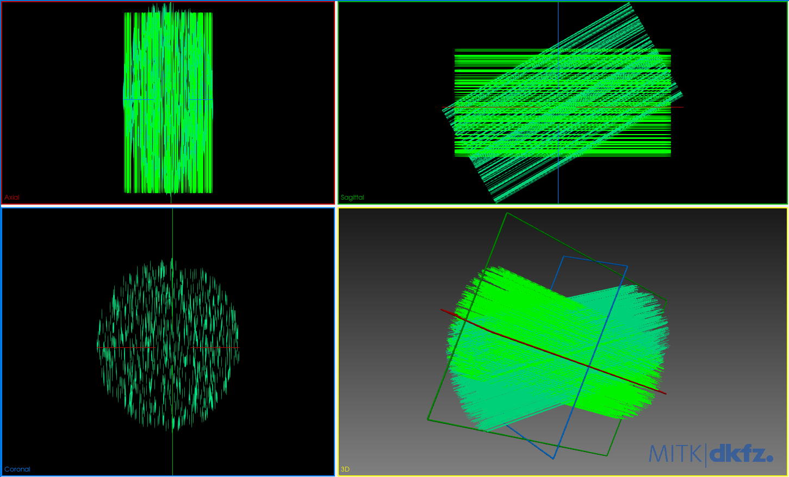

# voXSim

## Simulation Generator, voXSim and Fiberfox

voXSim is an amelioration of Fiberfox which, contrarily to the latter, allows its users to control the white matter
bundle generation through the command-line interface (CLI). Also, Simulation Generator offers a high level Python API to
voXSim. There are no equivalents for Fiberfox.

voXSim and Simulation Generator are both developed by Alex Valcourt Caron from the Sherbrooke Connectivity Imaging
Laboratory ([SCIL](https://scil.dinf.usherbrooke.ca/)).

## `.fib` file format

The `.fib` file format is
a [legacy VTK file format](https://kitware.github.io/vtk-examples/site/VTKFileFormats/#simple-legacy-formats). More
information can be found on the [VTK website](https://vtk.org/).
